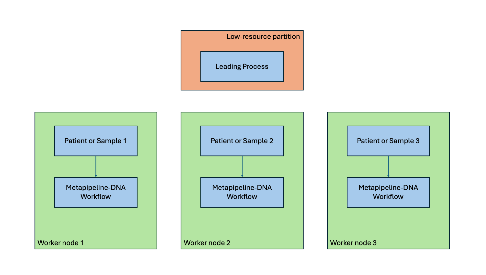
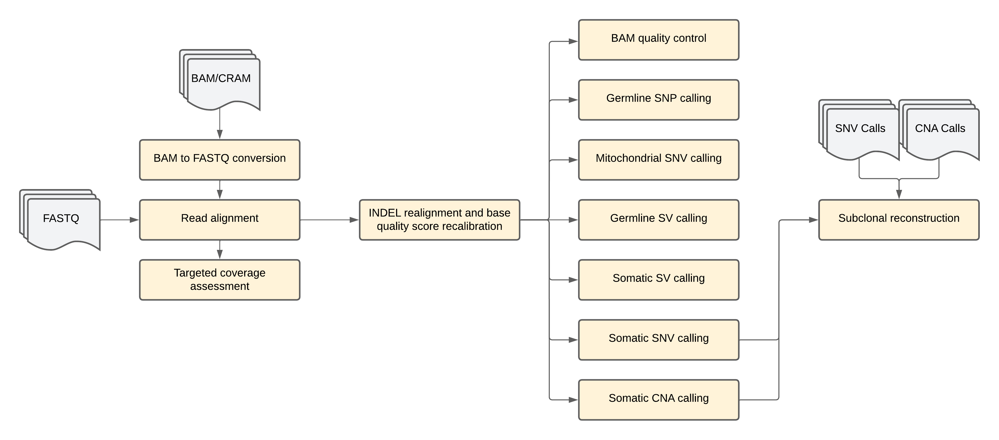

# metapipeline-DNA

- [metapipeline-DNA](#metapipeline-dna)
  - [Overview](#overview)
  - [How To Run](#how-to-run)
  - [Flow Diagram](#flow-diagram)
  - [Pipeline Steps](#pipeline-steps)
    - [1. convert-BAM2FASTQ](#1-convert-bam2fastq)
    - [2. align-DNA](#2-align-dna)
    - [3. calculate-targeted-coverage](#3-calculate-targeted-coverage)
    - [4. recalibrate-BAM](#4-recalibrate-bam)
    - [5. generate-SQC-BAM](#5-generate-sqc-bam)
    - [6. call-gSNP](#6-call-gsnp)
    - [7. call-sSNV](#7-call-ssnv)
    - [8. call-mtSNV](#8-call-mtsnv)
    - [9. call-gSV](#9-call-gsv)
    - [10. call-sSV](#10-call-ssv)
    - [11. call-sCNA](#11-call-scna)
    - [12. call-SRC](#12-call-src)
  - [Configuration](#configuration)
    - [WGS global job submission params - UCLAHS-CDS](#uclahs-cds-wgs-global-sample-job-submission-parameters)
    - [Pipeline selection](#pipeline-selection)
    - [Pipeline-specific params](#pipeline-specific-params)
    - [Intervals](#intervals)
    - [Sample modes](#sample-modes)
      - [Single](#single-sample-mode)
      - [Paired](#paired-sample-mode)
      - [Multi](#multi-sample-mode)
  - [Inputs](#inputs)
    - [Input BAM](#input-bam)
    - [Input FASTQ](#input-fastq)
    - [Input SRC](#input-src)
    - [Mixed input](#mixed-input)
      - [CNA](#cna-calls-available)
      - [SNV](#snv-calls-available)
  - [Outputs](#outputs)
  - [Discussions](#discussions)
  - [Contributors](#contributors)
  - [References](#references)
  - [License](#license)

## Overview

Metapipeline-DNA is a DNA sequencing processing pipeline that accepts sequencing data as input. The data may be in FASTQ format or in aligned format (BAM/CRAM - <u>**BETA FEATURE**</u>), with options for re-alignment with back-conversion to FASTQ format. The FASTQs are aligned to the reference genome and recalibrated with insertion-deletion (INDEL) realignment and base quality score recalibration, followed by quality control steps including targeted coverage calculation and whole genome sequencing (WGS) metrics. Various calling steps are performed to identify germline single-nucleotide polymorphisms (SNPs), somatic single-nucleotide variants (SNVs), mitochondrial SNVs, germline structural variants (SVs), somatic SVs, and somatic copy-number aberrations (CNAs). The processing culminates with subclonal reconstruction (SRC).

---

## How To Run

1. Create a config file using the [`template`](config/template.config), which takes the input samples along with general parameters, with a section defining the parameters, reference files, and resources configurations for each run and each pipeline. See [configuration](#configuration) for details on available options and configurations.

2. Create an `input.csv` or an `input.yaml` file (following the descriptions [here](#inputs)) to provide input files for each sample. If using an input CSV, add the path to the CSV to the config generated in step 1.


3. Submit the pipeline using the [submission script](https://github.com/uclahs-cds/tool-submit-nf).

> **warning**: A low-resource partition (*e.g* F2 with 2 CPUs and 4GB of memory) is sufficient for the leading job.

---

## Flow Diagram

The general execution of metapipeline-DNA follows the following steps:



Each worker node performs the following steps:



---

## Pipeline Steps

### 1. convert-BAM2FASTQ
*Optional*: Only run when BAM or CRAM are provided as input and realignment is not overriden.

Aligned data is back-converted to FASTQ using [pipeline-convert-BAM2FASTQ](https://uclahs-cds.github.io/pipeline-convert-BAM2FASTQ/).

### 2. align-DNA

FASTQ data is realigned to the genome on a per-sample basis using [pipeline-align-DNA](https://uclahs-cds.github.io/pipeline-align-DNA/).

### 3. calculate-targeted-coverage

For targeted or exome sequencing, depth for the target regions is assessed along with off-target coverage enrichment using [pipeline-calculate-targeted-coverage](https://uclahs-cds.github.io/pipeline-calculate-targeted-coverage/).

### 4. recalibrate-BAM

The aligned BAM undergoes INDEL realignment and base quality score recalibration using [pipeline-recalibrate-BAM](https://uclahs-cds.github.io/pipeline-recalibrate-BAM/).

### 5. generate-SQC-BAM

Quality control is performed on the recalibrated BAM using [pipeline-generate-SQC-BAM](https://uclahs-cds.github.io/pipeline-generate-SQC-BAM/).

### 6. call-gSNP

Germline SNPs are called using [pipeline-call-gSNP](https://uclahs-cds.github.io/pipeline-call-gSNP/).

### 7. call-sSNV

Somatic SNVs are called using [pipeline-call-sSNV](https://uclahs-cds.github.io/pipeline-call-sSNV/).

### 8. call-mtSNV

Mitochondrial SNVs are called using [pipeline-call-mtSNV](https://uclahs-cds.github.io/pipeline-call-mtSNV/).

### 9. call-gSV

Germline SVs are called using [pipeline-call-gSV](https://uclahs-cds.github.io/pipeline-call-gSV/).

### 10. call-sSV

Somatic SVs are called using [pipeline-call-sSV](https://uclahs-cds.github.io/pipeline-call-sSV/).

### 11. call-sCNA

Somatic CNAs are called using [pipeline-call-sCNA](https://uclahs-cds.github.io/pipeline-call-sCNA/).

### 12. call-SRC

Subclonal reconstruction is performed using [pipeline-call-SRC](https://uclahs-cds.github.io/pipeline-call-SRC/).

## Configuration

The following parameters are available at the metapipeline level:

| Parameter | Type | Required | Description |
| :---: | :--: | :------: | :---------: |
| `input_csv` | path | no | Absolute path to input CSV when using CSV input |
| `output_dir` | path | yes | Absolute path to directory where output files will be saved |
| `leading_work_dir` | path | yes | Absolute path to **common** working directory (under `/hot` for example for access across all nodes). **Cannot** be `/scratch` or any |
| `pipeline_work_dir` | path | yes | Absolute path to outputs from each individual pipeline before copying to `output_dir`. Default: `/scratch` |
| `project_id` | string | yes | Project identifier used to name the main output directory of the run |
| `save_intermediate_files` | boolean | yes | Whether to save intermediate files. Default: `false` |
| `status_email_address` | string | no | Email address to notify when child pipelines start and complete. Default: `` |
| `partition` | string | yes | Partition type for submitting each processing jobs |
| `clusterOptions` | string | yes | Additional `slurm` submission options |
| `max_parallel_jobs` | integer | yes | Number of jobs to submit at once. Default:  5 |
| `cluster_submission_interval` | integer | yes | Time in minutes to wait between job submissions, Default: 90 |
| `sample_mode` | string | yes | Mode for sample calling. Options: `paired`, `single`, `multi`. Default: `paired` |
| `requested_pipelines` | list | yes | List of pipelines requested. |
| `override_realignment` | boolean | yes | Whether to override conversion to FASTQ and realignment when given BAM input. Default: `false` |
| `override_recalibrate_bam` | boolean | yes | Whether to override recalibrate-BAM pipeline when given BAM input. Default: `false` |
| `use_original_intervals` | boolean | yes | Whether original intervals should be used with pipelines rather than expanded intervals generated by calculate-targeted-coverage |
| `run_downstream_pipelines_serially` | boolean | no | Whether to run pipelines downstream of recalibrate-BAM sequentially. Note: if this option is used in conjunction with `downstream_pipeline_order`, any pipelines with a given ordering will be run sequentially. Default: `false` |
| `downstream_pipeline_order` | list | no | List indicating specific order in which to run pipelines downstream of recalibrate-BAM. Default: no order |
| `src_snv_tool` | string | no | Which SNV tool's output to use for SRC. Default: `BCFtools-Intersect` |
| `src_cna_tool` | string | no | Which CNA tool's output to use for SRC. Default: `Battenberg` |
| `override_src_precursor_disable` | boolean | no | Whether to override the automatic disabling of either call-sSNV or call-sCNA when the respective outputs are provided in the input. Default: `false` |
| `src_run_all_combinations` | boolean | no | **TO-DO**: Whether to run SRC using all combinations of SNV tool and CNA tool. Default: `false` |
| `pipeline_params` | namespace | yes | Namespace containing parameters for each individual pipeline. Parameters for the requested pipelines must be given. |


### UCLAHS-CDS WGS global sample job submission parameters

The following parameters are intended to control the global number and rate of WGS jobs. By default, these parameters are enabled; in the case of non-WGS samples or non-UCLAHS-CDS environment, disable `uclahs_cds_wgs` in the config file params.

| Input Parameter | Type | Required | Description |
| :---: | :--: | :------: | :---------: |
| `uclahs_cds_wgs` | boolean | yes | Whether global job number and submission limits should be applied. Default: `true` |
| `global_rate_limit` | integer | yes | Time in minutes between submission of any WGS jobs. Default: 90 |

### Pipeline selection

Pipeline selection is controlled by the `requested_pipelines` parameter. Given the list of requested pipelines, metapipeline-DNA will automatically identify any necessary dependencies and enable them for the run.

Pipeline selection follows some default behaviors:

- When given BAM input, the default pipeline selector will perform conversion to FASTQ, re-align the FASTQs, and perform recalibration. This default behavior can be disabled with the `override_realignment` and `override_recalibrate_bam` parameters. With `override_realignment`, the back-conversion to FASTQ and re-alignment will be disabled. With `override_recalibrate_bam`, recalibration of the BAM using recalibrate-BAM will be disabled.
- When SNV or CNA calls are given as inputs, metapipeline-DNA will automatically disable the call-sSNV and call-sCNA pipelines, respectively, and use the given inputs for call-SRC. This behavior can be controlled by `override_src_precursor_disable` to let metapipeline-DNA run the call-sSNV and call-sCNA pipelines to generate inputs for call-SRC using the BAM or FASTQ inputs. **Note**: This option only has an effect in the case of mixed inputs being provided as the call-sSNV and call-sCNA pipelines require sequencing data as inputs.

### Pipeline-specific params

Each pipeline has a set of parameters that must be provided. The available parameters for each pipeline are documented in the links in the [steps](#pipeline-steps). Additionally, the default [template.config](./input/template.config) contains the default set of parameters that need to be defined for each pipeline. Any additional supported parameters can be added as needed. The following keys are used as the pipeline names in this namespace:

| Pipeline | Key |
| :---: | :---: |
| `convert-BAM2FASTQ` | `convert_BAM2FASTQ` |
| `align-DNA` | `align_DNA` |
| `recalibrate-BAM` | `recalibrate_BAM` |
| `calculate-targeted-coverage` | `calculate_targeted_coverage` |
| `generate-SQC-BAM` | `generate_SQC_BAM` |
| `call-gSNP` | `call_gSNP` |
| `call-sSNV` | `call_sSNV` |
| `call-mtSNV` | `call_mtSNV` |
| `call-gSV` | `call_gSV` |
| `call-sSV` | `call_sSV` |
| `call-sCNA` | `call_sCNA` |
| `call-SRC` | `call_SRC` |

Each pipeline also defines a set of resources per process to run. These resources can be modified if necessary on a per-process per-pipeline basis by using the `base_resource_update` functionality for the specific pipeline (this functionality is defined in each pipeline's README). For example, to double the base memory of all processes in the call-sSNV pipeline:

```Nextflow
params {
    ...
    pipeline_params {
        ...
        call_sSNV {
            ...
            base_resource_update {
                memory = [
                    [[], 2]
                ]
            }
        }
        ...
    }
}
```

### Intervals

For targeted or exome sequencing, target intervals can be provided in BED format to some of the steps to control processing. The following steps accept intervals:

| Step/pipeline | Parameter name |
| :---: | :---: |
| `call-sSNV` | `intersect_regions` |
| `call-gSNP` | `intervals` |
| `recalibrate-BAM` | `intervals` |
| `calculate-targeted-coverage` | `target_bed` |

For the respective pipeline params, provide the full path to the intervals file in the generated config to make use of the targets. For example:

```Nextflow
params {
    ...
    pipeline_params {
        ...
        call_sSNV {
            ...
            intersect_regions = "/full/path/to/intervals"
            ...
        }
        ...
    }
}
```

### Sample modes

The metapipeline supports running samples in three modes: `single`, `paired`, and `multi`. This is controlled by the `sample_mode` parameter. In `paired` or `multi` sample modes, each patient is expected to have exactly one normal sample and one or more tumor samples.

Given the set of input patients and samples, grouping of samples is controlled based on the run mode as follows:

#### Single sample mode
All samples are processed individually, regardless of patient, as separate jobs.
- Normal samples will go through germline calling (`call-gSNP`, `call-gSV`) and somatic SNV calling with `Mutect2`'s normal-only mode.
- Tumor samples will go through germline calling (`call-gSNP`) and somatic SNV calling with `Mutect2`'s tumor-only mode.

#### Paired sample mode
All samples from the same patient are submitted as a single job, with each normal-tumor pair processed separately in the same job.
- Individual samples will go through the `convert-BAM2FASTQ` and `align-DNA` pipelines.
- The normal sample will then be paired with each tumor sample and each pair will go through recalibration and the somatic calling pipelines.
- The normal sample will go through `call-gSV`.

#### Multi sample mode
All samples from the same patient are processed as a single job.
- Individual samples will go through the `convert-BAM2FASTQ` and `align-DNA` pipelines.
- The recalibration and germline SNP calling will then proceed on the entire set of samples together.
- Somatic SNV calling will proceed in two ways:
    1. The normal sample will be paired with each tumor sample and run through the `call-sSNV` pipeline
    2. If `Mutect2` was requested, the entire set of samples will go through multi-sample calling with just `Mutect2` in `call-sSNV`.
- The normal sample will be paired with each tumor sample and each pair will go through `call-mtSNV`, `call-sSV`, and `call-sCNA`.
- The normal sample will go through `call-gSV`.

---

## Inputs

Inputs can be provided in either CSV or YAML format.

For CSV inputs, identify the fields needed for each input type below and include the respective fields. For mixed inputs, use empty cell values - see [template CSVs](input) for examples.

For YAML inputs, see [template YAMLs](input). In each template YAML, any key or value in `<>` needs to be filled in and the `<>` removed, ex. `<patient1>` should be filled in with the actual patient ID, e.g. `PRAD0001`. Other keys not in `<>` must be kept as they are.
```YAML
---
input:
    <patient1>:
...
```
should be filled in to become:
```YAML
---
input:
    PRAD0001:
...
```

### Input BAM

| Field | Type | Required | Description |
| :---: | :--: | :------: | :---------: |
| patient | string | yes | Identifier for the patient |
| sample | string | yes | Identifier for the sample |
| state | string | yes | Must be either "tumor" or "normal" |
| path | path | yes | Absolute path to the sample BAM file |

See this [template](input/template-input-BAM.csv) for CSV format and this [template](input/template-input-BAM.yaml) for YAML format.

### Input FASTQ

| Field | Type | Required | Description |
| :---: | :--: | :------: | :---------: |
| patient | string | yes | Identifier for the patient |
| sample | string | yes | Identifier for the sample |
| state | string | yes | Must be either "tumor" or "normal" |
| read_group_identifier | string | yes | Read group ID |
| sequencing_center | string | yes | Center where sequencing was performed |
| library_identifier | string | yes | Library used for sample |
| platform_technology | string | yes | Technology used for sequencing |
| platform_unit | string | yes | Name of specific platform unit |
| bam_header_sm | string | yes | Sample name tag for BAM |
| lane | string | yes | Lane identifier for sample |
| read1_fastq | path | yes | Absolute path to R1 FASTQ |
| read2_fastq | path | yes | Absolute path to R2 FASTQ |

See this [template](input/template-input-FASTQ.csv) for CSV format and this [template](input/template-input-FASTQ.yaml) for YAML format.

### Input SRC

For SRC input, only `call-SRC` can be run. In this case, for each tumor sample, SNV calls and CNA calls must be provided.

| Field | Type | Required | Description |
| :---: | :--: | :------: | :---------: |
| patient | string | yes | Identifier for the patient |
| sample | string | yes | Identifier for the sample |
| state | string | yes | Must be either "tumor" or "normal" |
| src_input_type | string | yes | The type of input, must be either "CNA" or "SNV" |
| src_input_algorithm | string | yes | Algorithm used to generate the input |
| src_path | string | yes | Full path to the file |

See this [template](input/template-input-SRC.csv) for CSV format and this [template](input/template-input-SRC.yaml) for YAML format.

### Mixed input

A mix of SRC and sequencing inputs can also be provided, in cases where for example CNA calling has already been done and SNV calling needs to be performed.

#### CNA calls available

If CNA calls are already available, provide the CNA calls as SRC input and provide the sequencing data (either FASTQ or BAM/CRAM) as FASTQ or BAM/CRAM input. With CSV input, keep all columns and leave fields black per row as needed. See [template CSV](./input/template-input-mix-SRC-CNA.csv) for the CSV format and [template YAML](./input/template-input-mix-SRC-CNA.yaml) for the YAML format.

#### SNV calls available

If SNV calls are already available, provide the SNV calls as SRC input and provide the sequencing data (either FASTQ or BAM/CRAM) as FASTQ or BAM/CRAM input. With CSV input, keep all columns and leave fields black per row as needed. See [template CSV](./input/template-input-mix-SRC-SNV.csv) for the CSV format and [template YAML](./input/template-input-mix-SRC-SNV.yaml) for the YAML format.

---

## Outputs

Outputs will be placed under `<params.output_dir>/metapipeline-DNA-<version>/<params.project_id>` and organized by individual pipeline. See individual pipeline documentation for specific outputs generated per pipeline.

---

## Discussions

- [Issue tracker](https://github.com/uclahs-cds/metapipeline-DNA/issues) to report errors and enhancement ideas.
- Discussions can take place in [metapipeline-DNA Discussions](https://github.com/uclahs-cds/metapipeline-DNA/discussions)
- [metapipeline-DNA pull requests](https://github.com/uclahs-cds/metapipeline-DNA/pulls) are also open for discussion

---

## Contributors

Please see list of [Contributors](https://github.com/uclahs-cds/metapipeline-DNA/graphs/contributors) at GitHub.

---

## References
- Yash Patel, Arpi Beshlikyan, Madison Jordan, Gina Kim, Aaron Holmes, Takafumi N Yamaguchi, Paul C Boutros, PipeVal: light-weight extensible tool for file validation, Bioinformatics, Volume 40, Issue 2, February 2024, btae079, https://doi.org/10.1093/bioinformatics/btae079
- Yash Patel, Chenghao Zhu, Takafumi N Yamaguchi, Yuan Zhe Bugh, Mao Tian, Aaron Holmes, Sorel T Fitz-Gibbon, Paul C Boutros, NFTest: automated testing of Nextflow pipelines, Bioinformatics, Volume 40, Issue 2, February 2024, btae081, https://doi.org/10.1093/bioinformatics/btae081

## License

metapipeline-DNA is licensed under the GNU General Public License version 2. See the file LICENSE for the terms of the GNU GPL license.

Metapipeline-DNA is a Nextflow pipeline to convert BAM to FASTQ, align, perform QC, assess targeted coverage, call gSNP, call sSNV, call mtSNV, call SVs, call sCNA, and perform subclonal reconstruction.

Copyright (C) 2021-2024 University of California Los Angeles ("Boutros Lab") All rights reserved.

This program is free software; you can redistribute it and/or modify it under the terms of the GNU General Public License as published by the Free Software Foundation; either version 2 of the License, or (at your option) any later version.

This program is distributed in the hope that it will be useful, but WITHOUT ANY WARRANTY; without even the implied warranty of MERCHANTABILITY or FITNESS FOR A PARTICULAR PURPOSE. See the GNU General Public License for more details.
